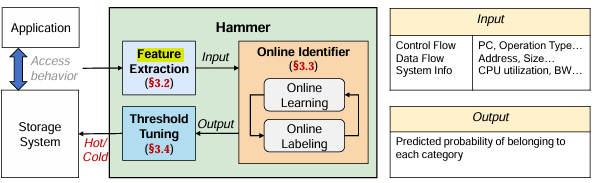
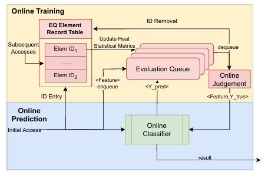

# Online-Hotness-Identifier

An online learning-based heat prediction model to cope with conceptual drift in long-running systems.

## Dependencies

We use the algorithms provided by the River Online Learning Library, which can be installed via

``` bash
pip install river
```

We have sampled memory behaviour across a wide range of application loads using the DrMemtrace tool, which can be accessed at [this link](https://github.com/DynamoRIO/dynamorio/releases/tag/cronbuild-10.93.19965).

## Trace memory behavior

### How to Trace memory behavior

Collecting and processing the memory access behaviour of the application operates as follows, with adjustable parameters. See trace.bash for details.

``` bash
bin64/drrun -t drmemtrace -offline -L0I_filter -L0I_size 0 -skip_refs 10 -max_trace_size 10M -- <bench> <args>

bin64/drrun -t drmemtrace -tool view -indir drmemtrace.PageRank* -compress lz4 -sim_refs 10M 2>&1 | tee logs/xx.trace
```

### Introduction to selected applications

The selected applications involve four categories: machine learning, high-performance computing, graph computing, and big data processing. Specifically, open-source applications such as tiny-DNN, Pytorch-Networks, ligra, MapReduce, trng, distance-matrix, etc., were selected.

## Online Data Hotness Identifier



### Feature extraction

In order to accurately predict the hot and cold states of data, it is essential to extract key features from the storage  access behaviour. Such features should encompass not only data flow information, but also control flow information. Furthermore, system information is an essential component. This multi-dimensional feature extraction approach offers a more comprehensive view, enabling the model to comprehend the intricacies of data access behaviour and identify the  pivotal factors influencing the hot and cold states of data. The heat feature extraction module constructs feature vectors to characterise data heat based on information such as application behaviour and system state. The information sources are divided into three main categories: data flow, control flow, and system information. Specific features can be customised in the actual system, currently PC, Address, OP, Size, CPU utilization and bandwidth of different media are selected by default.

### Online Classification and Evaluation

The full process of online hotness judgement is as follows:



* **Initial Prediction Stage**: The first stage involves the online classifier generating predicted classification results based on past training as soon as a new data access occurs. This design ensures that the system can provide immediate feedback, which is crucial for real-time data processing systems.
* **Feature Vector Extraction**: Following the initial prediction, the feature vector associated with the new data access is extracted. This vector encapsulates the essential characteristics of the data access, including but not limited to, data f low, control flow, and system information.
* **Evaluation Queue Management**: The extracted feature vector is then added to an evaluation queue, which operates on a first-in-first-out (FIFO) principle. This queue has a finite capacity, ensuring that only the most recent data accesses are retained for evaluation. This design is pivotal for maintaining the system’s responsiveness and efficiency
* **Heat Index Update**: While the feature vector is in the evaluation queue, the system accesses the corresponding part of the memory and updates the heat index. This index is a critical metric that reflects the recency and frequency of data access, thus influencing data storage and retrieval strategies.